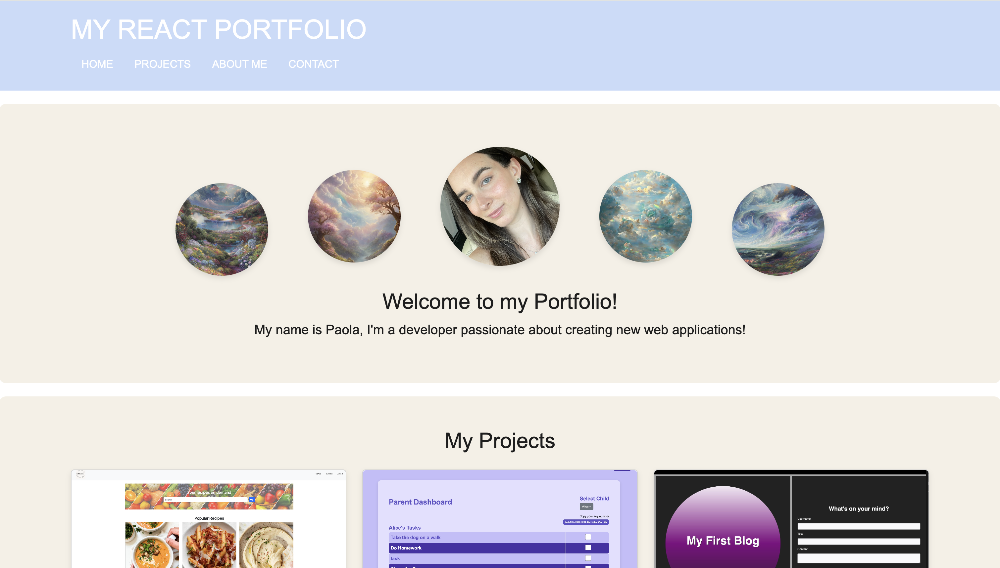

# Paola's React Portfolio


##  Description

This is my personal portfolio built with React, showcasing my projects, skills, and contact information. The purpose of this portfolio is to highlight my work as a developer and provide an easy way for employers or collaborators to reach out.

---

##  Features

- **Responsive Design**: Works perfectly on both desktop and mobile devices.
- **Projects Section**: Each project includes a description, an image, and a link to its GitHub repository.
- **Contact Form**: Users can reach out to me directly through the integrated email form.
- **Modern UI**: Styled using Bootstrap and custom CSS for a sleek look.

---

##  Technologies Used

- [React](https://reactjs.org/)
- [Vite](https://vitejs.dev/)
- [Bootstrap](https://getbootstrap.com/)
- [Netlify](https://www.netlify.com/)

---

##  Deployed Application
- Deployed Application: https://paolasportfolio.netlify.app/


##  Screenshots




---

## 📂 Project Structure

```plaintext
react-portfolio/
├── public/
│   ├── favicon.ico
│   └── vite.svg
├── src/
│   ├── assets/
│   ├── components/
│   │   ├── About.jsx
│   │   ├── Contact.jsx
│   │   ├── Footer.jsx
│   │   ├── Header.jsx
│   │   ├── Hero.jsx
│   │   └── Projects.jsx
│   ├── App.jsx
│   └── main.jsx
├── .gitignore
├── index.html
├── package.json
└── README.md
